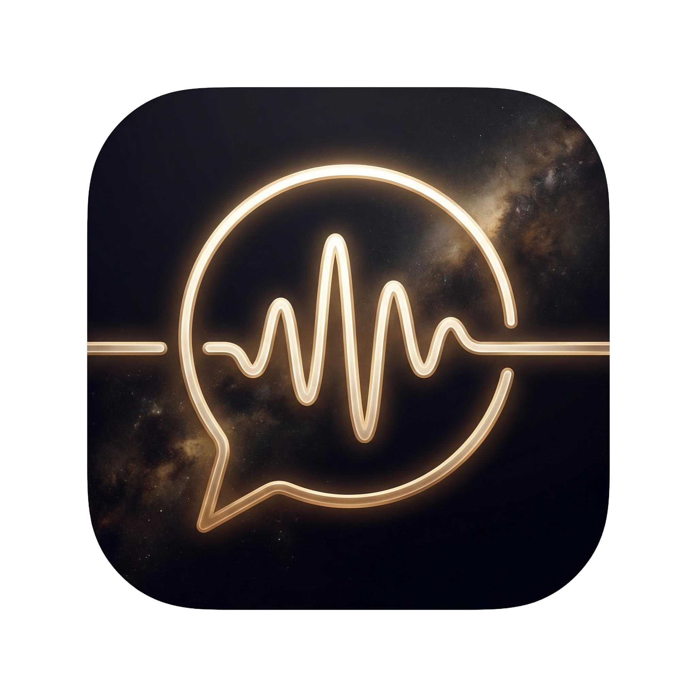
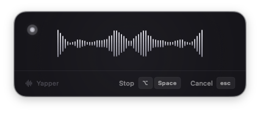
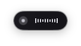

<p align="center">
  
  <br>
  <h1 align="center">Yapper</h1>
</p>

Dictation app for macOS. Talk, and it types. Whisper runs locally on your Mac. If you want an LLM to clean up what you said, plug in OpenAI, Anthropic, or run Ollama on your own hardware.

<p align="center">
  
  
  
</p>

<p align="center">
  
  &nbsp;&nbsp;
  
</p>

---

## How it works

Press a hotkey, talk, let go. Text shows up wherever your cursor is.

Whisper handles the transcription right on your machine (defaults to the large-v3-turbo model). If you want the output cleaned up, polished, or reformatted, an LLM does that as a second pass. You pick which one.

There are seven built-in modes, or make your own:

| Mode | What it does |
|------|-------------|
| Voice to Text | Raw transcription, nothing added or removed |
| Email | Turns your rambling into something you'd actually send |
| Message | Casual cleanup, just the rough edges |
| Note | Bullet points from a stream of consciousness |
| Meeting | Pulls out action items, decisions, who said what |
| Smart | Looks at what app you're in and writes accordingly |

Email, Message, Note, Meeting, and Smart send the transcript through an LLM (OpenAI, Anthropic, or Ollama). Voice to Text stays entirely local.

The AI modes also read your clipboard, selected text, and active app for context. So if you're in a code editor, it formats differently than if you're in Mail.

---

## Get it running

macOS 13+ and Xcode Command Line Tools (`xcode-select --install`).

```bash
./scripts/setup-whisper.sh   # builds whisper.cpp, downloads the large-v3-turbo model (~1.5GB)
swift build
.build/debug/Yapper
```

macOS will ask for microphone and accessibility permissions. Grant both.

Left-click the menubar waveform icon to start recording (right-click for the menu). Or press Option+Space from anywhere. Talk, then press it again. Text lands at your cursor.

For a release .app bundle:

```bash
./build.sh                   # builds + signs -> dist/Yapper.app
YAPPER_DIST=1 ./build.sh     # ad-hoc signed for distribution
```

Intel build:

```bash
./build-intel.sh             # cross-compiles whisper.cpp for x86_64
```

DMG installer:

```bash
./create-dmg.sh              # creates dist/Yapper-0.1.0-apple-silicon.dmg
```

---

## AI providers

You choose what processes your text. Or nothing at all.

| Provider | Where it runs | Setup |
|----------|--------------|-------|
| None (Voice to Text mode) | Your Mac | Nothing needed |
| OpenAI | Cloud | Add API key in Settings |
| Anthropic | Cloud | Add API key in Settings |
| Ollama | Your Mac | Install Ollama, pull a model |

Settings detects if Ollama is running and shows your local models in a dropdown. The base URL is configurable if you're running it on another machine.

API keys are stored in a local file at `~/Library/Application Support/Yapper/`.

---

## The cycle-to-record thing

Hit the cycle modes hotkey. The recording window appears with the next mode name. Keep hitting it to flip through modes. Once you stop, recording kicks in after about a second and a half.

You can also use the Fn (globe) key as a modifier in your hotkey combos.

---

## Project layout

```
Sources/Yapper/
├── YapperApp.swift              # entry point, menubar setup
├── Core/
│   ├── Audio/AudioEngine        # mic recording (AVFoundation)
│   ├── ASR/WhisperService       # whisper.cpp transcription
│   ├── AI/AIProcessor           # OpenAI, Anthropic API calls
│   ├── AI/OllamaService         # local Ollama model discovery + chat
│   ├── Context/ContextCapture   # clipboard, selection, active app
│   ├── Output/TextInserter      # pastes text via Accessibility APIs
│   ├── Storage/StorageManager   # JSON settings, API keys, history
│   ├── RecordingCoordinator     # record -> transcribe -> AI -> insert
│   └── HotkeyManager           # global hotkeys + Fn key support
├── Models/                      # Mode, Session, Settings
├── Views/                       # SwiftUI (Settings, Recording, History)
└── Resources/                   # icon assets, Info.plist
```

Swift Package Manager. Whisper.cpp linked as a C library through `Vendor/CWhisper`.

---

## Working on it

Add a mode: `Sources/Yapper/Models/Mode.swift`, define a static `Mode`, append to `allBuiltIn`.

Change what the AI does with your text: edit the `instructions` field on any mode definition.

Add a new AI provider: new case in `AIProvider`, implement the API call in `AIProcessor.swift`.

Hotkeys: Settings > Shortcuts in the app, or edit `Settings.swift` for defaults.

Tests: `swift test`. Quick manual check: record something, does it transcribe, does the text end up in TextEdit, do settings stick after a restart.

---

## Troubleshooting

| Problem | Fix |
|---------|-----|
| Mic not working | System Settings > Privacy & Security > Microphone, enable Yapper |
| Text not inserting | Same but Accessibility instead of Microphone |
| Model not found | Run `./scripts/setup-whisper.sh` or download from Settings > Advanced |
| Build cache weirdness | `swift package clean && swift build` |
| AI not responding | Check your key in Settings > API Keys. Ollama running? |
| AI taking forever | It'll bail after 15 seconds and paste whatever Whisper gave it |

---

## FAQ

**Do I need internet?** No. Voice to Text is completely offline. The AI modes need a connection unless you're using Ollama locally.

**Which Whisper model?** Large-v3-turbo is the default and the sweet spot. Tiny if you're on an older machine. Large if you want maximum accuracy and don't mind waiting.

**Works everywhere?** Most apps. Password fields and a few sandboxed apps won't let it paste. macOS security restriction, not a bug.

**Why does macOS block the app?** We don't have an Apple Developer ID ($99/year). Run `xattr -cr /Applications/Yapper.app` after installing, or use the curl install method on the [website](https://ahmedlhanafy.github.io/yapper/).

---

## Docs

- [Whisper integration](docs/WHISPER_INTEGRATION_GUIDE.md)
- [Testing guide](docs/TESTING_GUIDE.md)
- [Release checklist](docs/RELEASE_CHECKLIST.md)
- [Project summary](docs/PROJECT_SUMMARY.md)
- [Website](https://ahmedlhanafy.github.io/yapper/)

---

## Thanks

- [Whisper.cpp](https://github.com/ggerganov/whisper.cpp) by Georgi Gerganov
- [OpenAI Whisper](https://openai.com/research/whisper)
- Anthropic Claude
- The Ollama project

---

MIT License. Created by [Ahmed Elhanafy](https://github.com/ahmedlhanafy).
